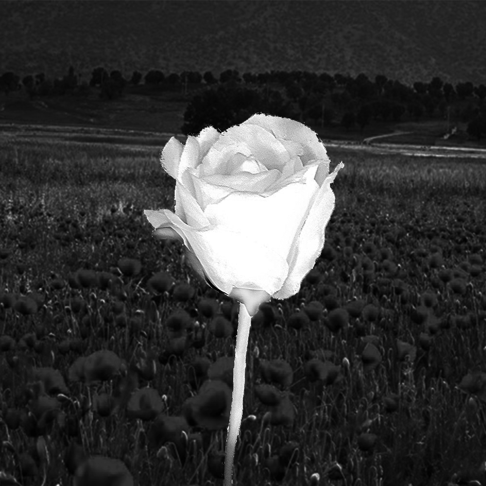
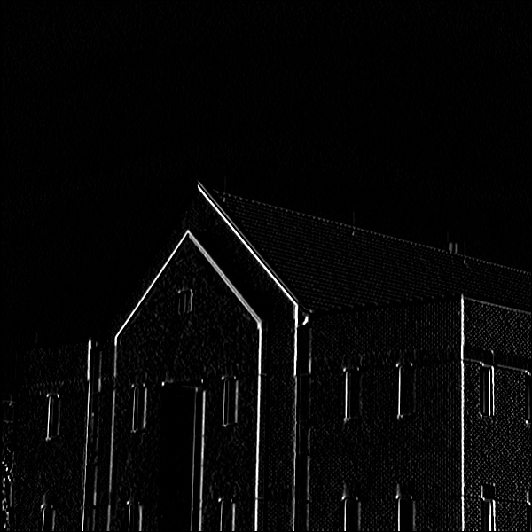

# image_processing4

Il s'agit des divers filtres que j'ai mis sur chaque image.
Comme vous pouvez voir le resultat dans la deuxième photo de chaque partie.

## test1 :
cela rend flou le background sans influencer sur la fleur.

input:

output:

## test2 : 

input:

output:

## test3 :

## test4 :

input:

output:

## test5 :

.Détecte la couleur dans le camera!

(video_detectColors.avi)

